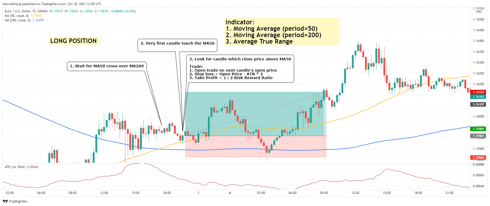

## SMA Pull Back

### Time Frame

- 15 minutes

### Indicator

1. Moving Average (period=50)
1. Moving Average (period=200)
1. Average True Range

### Take Profit & Stop Loss

- Stop Loss
  - Average True Range \* 2
- Take Profit
  - 1 : 2 Risk Reward Ratio

#### Long Position

1. MA50 cross over MA200
1. Very first candle touch the MA50 (ohlc)
1. Current or next candle closing price above MA50
1. Trade on next opening price
1. Stop loss = trade open price - ATR \* 2
1. Take Profit = risk reward ratio 1 : 2

##### example for long position

#### Short Position

1. MA50 cross down MA200
1. Very first candle touch the MA50 (ohlc)
1. Current or next candle closing price below MA50
1. Trade on next opening price
1. Stop loss = trade open price + ATR \* 2
1. Take Profit = risk reward ratio 1 : 2

##### example for short position

